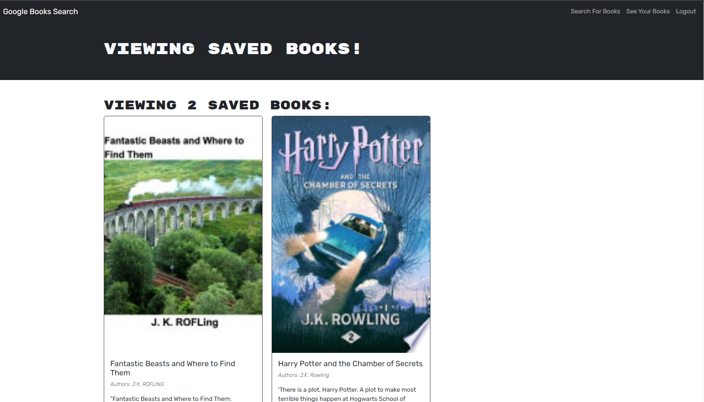

# Book Search Engine

## Description
This project was originally a RESTful API that searched for books on Google. I was responsible for refactoring it to be a GraphQL API built with the Apollo Server. I created the resolvers and typeDefs based off the original code, and added queries and mutations. The user can now search Google books via GraphQL and Apollo.

## Usage

Here is the link to the deployed application:

